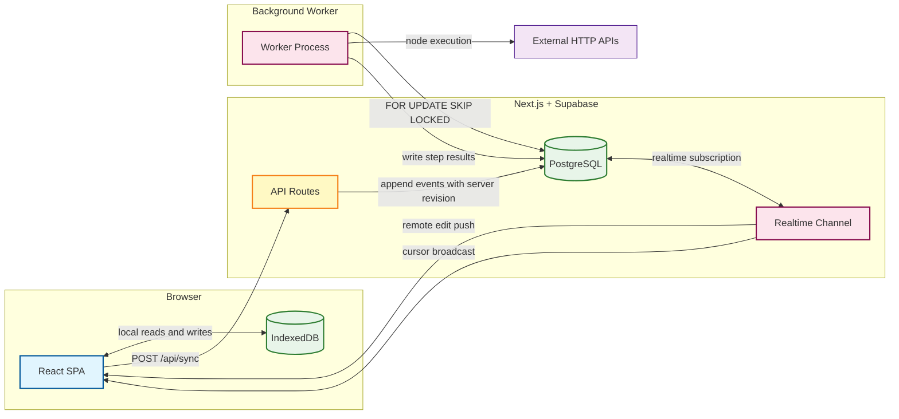

# Kinetk

[](https://kinetk.app/) [](https://nextjs.org/) [](https://www.typescriptlang.org/) [](https://supabase.com/) [](https://vercel.com/)

**Live Application:** [**https://kinetk.app**](https://kinetk.app/)

## Project Overview

Kinetk is a **local-first webhook workflow builder** for developers. It solves the fragmented debugging experience of webhook-driven automation: most tools offer either a visual editor *or* step-level observability, never both. Kinetk provides a fast, offline-capable canvas where developers design execution graphs locally, syncs changes through an append-only event log to a shared Postgres backend, and delivers step-level input/output/error snapshots for every node in every execution run.

The system proves one complete vertical slice end-to-end: a user designs a multi-node workflow on a local canvas → changes persist immediately to IndexedDB → events sync to the backend through a conflict-safe log → a secure webhook trigger starts a run → a background worker claims and executes each node in isolation → the user inspects full run history and per-step observability.

## Tech Stack

| Frontend | Backend | Infrastructure | Testing |
|---|---|---|---|
|  |  |  |  |
|  | -3FCF8E?logo=supabase&logoColor=white) |  | |
| -F6820D) | -4169E1?logo=postgresql&logoColor=white) | | |

## High-Level System Design

The architecture was driven by five core engineering constraints specific to building a local-first, multi-tenant workflow engine as a lean, production-grade system:

1. **Local-First State:** IndexedDB is the authoritative source of truth for the UI. The canvas renders from a local snapshot and applies edits optimistically. Postgres is the durable, auditable backend — not the primary interaction layer.

2. **Deterministic Sync via Append-Only Log:** Workflow mutations are never sent as full-graph diffs. Every edit is an immutable, versioned event with a client-side idempotency key. The server assigns monotonic `server_revision` integers inside a transaction, making replay and conflict detection mathematically precise.

3. **Lean Infrastructure by Design:** PostgreSQL replaces Redis and BullMQ as the execution queue through `FOR UPDATE SKIP LOCKED`. This keeps the stack to a single data store until throughput demands a dedicated broker — avoiding operational overhead that an MVP cannot justify.

4. **Defense-in-Depth Security:** Tenant isolation is enforced at two independent layers simultaneously: explicit workspace membership checks in the Next.js service layer, and Row-Level Security (RLS) policies at the database. A bug in one layer cannot compromise the other.

5. **Performance at the Framework Boundary:** React is the wrong tool for high-frequency pointer events. Node drag sessions and multiplayer cursor positions bypass React state entirely, using mutable refs and a `requestAnimationFrame` loop to apply `style.transform` directly to DOM nodes at 60 fps.



## Key Architectural Features & Implementations

### 1. 60 fps Canvas Rendering — Bypassing the React Reconciler

**The Problem:** A node-based canvas requires sub-millisecond drag response. Routing `pointermove` events through React state triggers the full reconciler — graph validation, `useMemo` recomputation, and component subtree diffing — on every frame, dropping effective framerate to 20–30 fps under a moderate node count.

**The Solution:** Active drag sessions and multiplayer cursor positions are held in mutable `useRef` objects. A `requestAnimationFrame` loop reads from these refs and applies `style.transform` directly to DOM nodes using hardware-accelerated CSS. React state and IndexedDB are only updated at the `pointerup` commit boundary — not during the drag.

The same pattern governs the multiplayer cursor overlay. Supabase Realtime broadcasts arrive at up to 20 fps from remote tabs. Updating React state on each broadcast would cause N × 20 re-renders per second across N concurrent users. Instead, positions are written to a `Map` held in a `useRef`, and a single RAF loop applies `translate(x, y)` directly to each cursor's DOM element. A CSS `transition: transform 50ms linear` on the cursor container lets the GPU interpolate between 20 fps updates, producing visually smooth 60 fps motion with zero JavaScript math.

```typescript
// canvas.tsx — CursorOverlay RAF loop
// Reads from a mutable ref; React re-renders only on join/leave, never on move.
useEffect(() => {
  if (presenceUsers.length === 0) return;
  let rafId: number;

  function tick() {
    const vp = viewportRef.current;
    for (const { sessionId } of presenceUsers) {
      const pos = cursorPositionsRef.current?.get(sessionId);
      const el  = domRefs.current.get(sessionId);
      if (!pos || !el) continue;
      el.style.transform =
        `translate(${pos.x * vp.zoom + vp.x - 2}px, ${pos.y * vp.zoom + vp.y - 2}px)`;
    }
    rafId = requestAnimationFrame(tick);
  }

  rafId = requestAnimationFrame(tick);
  return () => cancelAnimationFrame(rafId);
}, [presenceUsers, cursorPositionsRef]); // restarts only on join/leave
```

---

### 2. Append-Only Sync Engine — Idempotency Keys and Monotonic Revisions

**The Problem:** Users edit workflows offline in IndexedDB and sync when connectivity returns. A full-graph diff approach cannot detect conflicts, cannot replay history, and silently drops concurrent edits from other sessions.

**The Solution:** Every mutation is an immutable event — `node_added`, `node_moved`, `edge_deleted`, etc. — carrying a `clientEventId` (a `nanoid()` generated client-side before the first write) and a `eventSchemaVersion`. The server assigns a monotonic `server_revision` integer inside a serializable transaction. The client sends its `baseServerRevision`; if the server's current revision doesn't match, a `SyncRevisionConflictError` is raised and the client is signaled to fetch the latest snapshot rather than silently overwrite state.

Duplicate events — caused by network retries — are handled by `findExistingRevisions`, which checks `client_event_id` against the event log before inserting. Events that already exist are returned with their original `server_revision` rather than re-inserted, guaranteeing end-to-end idempotency.

```typescript
// server/sync/service.ts — conflict detection inside a serializable transaction
if (input.baseServerRevision !== syncState.currentVersion) {
  throw new SyncRevisionConflictError(
    syncState.currentVersion,   // what the server holds
    input.baseServerRevision,   // what the client sent
  );
}

// Idempotency: skip events the log has already committed
const existingRevisions = await findExistingRevisions(txDb, workflowId, clientEventIds);
const newEvents = input.events.filter(
  (e) => !existingRevisions.has(e.clientEventId),
);
```

```typescript
// client/sync/sync-engine.ts — client interprets a non-2xx as a diverged state
const response = await fetch("/api/sync", {
  method: "POST",
  body: JSON.stringify({ workflowId, baseServerRevision, events }),
});

if (!response.ok) {
  onStatusChange("refresh_required"); // surfaces conflict recovery UI
  return;
}
```

---

### 3. Postgres Execution Queue — `FOR UPDATE SKIP LOCKED`

**The Problem:** Webhook executions must be processed asynchronously with support for retries, timeouts, and concurrent worker isolation, without introducing a dedicated message broker like Redis or BullMQ.

**The Solution:** PostgreSQL is used as the queue substrate. The worker claims runs with a single atomic `UPDATE ... WHERE id = (SELECT ... FOR UPDATE SKIP LOCKED)` statement. Row-level locking ensures that two worker processes polling concurrently cannot claim the same run. A `locked_by` column and a `lease_expires_at` timestamp allow a separate stall-reclaim job to return orphaned runs to `queued` status if a worker crashes mid-execution.

```sql
-- worker/claim-run.ts — atomic claim with worker isolation
UPDATE public.workflow_runs
SET
  status            = 'running',
  started_at        = COALESCE(started_at, NOW()),
  run_attempt       = run_attempt + 1,
  locked_by         = $1,          -- worker process PID
  lease_expires_at  = NOW() + INTERVAL '5 minutes'
WHERE id = (
  SELECT id FROM public.workflow_runs
  WHERE  status = 'queued'
    AND  (next_attempt_at IS NULL OR next_attempt_at <= NOW())
  ORDER BY queued_at
  FOR UPDATE SKIP LOCKED
  LIMIT 1
)
RETURNING id, workspace_id, workflow_id, input_snapshot_json,
          timeout_ms, max_steps, run_attempt;
```

A separate `reclaim-stalled-runs` job resets any run whose `lease_expires_at` has passed back to `queued`, providing automatic retry without external orchestration.

---

### 4. Defense-in-Depth Security — Dual-Layer Tenant Isolation

**The Problem:** In a multi-tenant environment, a single routing bug in application code could expose one workspace's encrypted secrets, webhook logs, or execution history to another user.

**The Solution:** Tenant isolation is enforced at two independent, redundant layers. The Next.js service layer performs explicit workspace membership checks before any query executes. PostgreSQL Row-Level Security acts as a strict database-level perimeter that cannot be bypassed regardless of application logic.

Critically, `INSERT`, `UPDATE`, and `DELETE` privileges are **stripped from the Supabase anon/authenticated roles**. All mutations flow through a trusted backend `pg` pool that connects as the Postgres superuser, bypassing RLS by design. The Supabase REST API — which uses the authenticated role — is read-only by construction, meaning a compromised API key cannot write data.

```sql
-- supabase/migrations/0002_rls_policies.sql
ALTER TABLE public.workflows ENABLE ROW LEVEL SECURITY;

-- Supabase anon/authenticated roles can only read rows in their workspace.
-- Mutations are blocked at the privilege level — no INSERT/UPDATE/DELETE policy exists.
CREATE POLICY "workspace members only" ON public.workflows
  FOR SELECT
  USING (
    workspace_id IN (
      SELECT workspace_id FROM public.workspace_members
      WHERE user_id = auth.uid()
    )
  );
```

Webhook trigger tokens are stored as SHA-256 hashes. The plaintext token is returned exactly once at creation time and never persisted. Workspace secrets (HTTP credentials) are AES-256-GCM encrypted at rest with a key derived from an application secret, decrypted only at execution time inside the worker.

---

### 5. Real-Time Collaboration — Presence + Broadcast Separation

**The Problem:** Multiplayer presence requires two fundamentally different data flows: durable join/leave state (who is viewing a workflow) and ephemeral, high-frequency cursor positions. Conflating them with a single mechanism produces either stale cursors or excessive database writes.

**The Solution:** Supabase Realtime channels handle both, but with deliberate separation. **Presence** (`channel.track()`) manages join/leave identity state — it fires reliably on connect and disconnect, and its state is synced to new joiners automatically. **Broadcast** (`channel.send()`) carries cursor positions — it is fire-and-forget, reaches all subscribers in under 100 ms, and **never touches the database**.

```typescript
// client/realtime/use-workflow-presence.ts
// Presence: durable join/leave identity only
await channel.track({ sessionId, userId, displayName });

// Broadcast: ephemeral cursor position — 20fps, 4px dead-zone, integer-rounded
void channel.send({
  type: "broadcast",
  event: "cursor",
  payload: { sessionId, x: Math.round(x), y: Math.round(y) },
});

// Receiver: writes to a mutable ref — zero React re-renders
channel.on("broadcast", { event: "cursor" }, ({ payload }) => {
  if (payload.sessionId === sessionId) return;
  cursorPositionsRef.current.set(payload.sessionId, { x: payload.x, y: payload.y });
});
```

The send side enforces a 50 ms throttle combined with a 4-pixel movement dead-zone (squared-distance check `dx² + dy² < 16`) to eliminate noise from micro-jitter. This reduces broadcast volume by ~80% for a stationary or slowly-moving mouse.

---

## Key Challenge & Solution: State Drift and Sync Conflict Recovery

**The Challenge:** A user can edit a workflow offline for minutes, then attempt to sync. If another session committed events in the interim, the client's `baseServerRevision` will be stale. A naive sync would silently overwrite the server's state with the client's local view — dropping remote edits without warning. Equally dangerous: a retry of a previously committed sync request could insert duplicate events, corrupting the revision sequence.

**The Solution:** The sync service executes inside a serializable Postgres transaction. The server's current `server_revision` is fetched under a row-level lock and compared to the client's `baseServerRevision`. A mismatch is an immediate, typed error:

```typescript
// server/sync/service.ts
export class SyncRevisionConflictError extends WorkflowSyncError {
  constructor(
    readonly expectedRevision: number, // what the server currently holds
    readonly receivedRevision: number, // what the client claimed as base
  ) {
    super("refresh_required");
  }
}

// Inside the transaction — if revisions diverge, abort. No partial writes.
if (input.baseServerRevision !== syncState.currentVersion) {
  throw new SyncRevisionConflictError(
    syncState.currentVersion,
    input.baseServerRevision,
  );
}
```

The client receives a non-2xx response, transitions to a `refresh_required` status, and surfaces a **Conflict Recovery UI** that presents the user with a clear choice: keep their local edits (discard remote) or pull the latest server snapshot (discard local). No data is silently lost in either path. Retry safety is handled separately: `clientEventId` keys are checked against the existing event log before insertion, so a network retry that re-sends an already-committed batch is a no-op with identical output.

---

## Getting Started

### Prerequisites

- Node.js 22+
- [Supabase CLI](https://supabase.com/docs/guides/cli)
- Docker Desktop (required by the Supabase CLI for local development)

### 1. Install dependencies

```bash
npm install
```

### 2. Start local Supabase

```bash
supabase start
```

Starts a local Postgres instance and applies all migrations from `supabase/migrations/`. The CLI prints local URLs and keys — copy them for the next step.

### 3. Configure environment variables

```bash
cp .env.example .env.local
```

Fill in the values from the `supabase start` output. Generate `APP_ENCRYPTION_KEY_BASE64` with:

```bash
node -e "console.log(require('crypto').randomBytes(32).toString('base64'))"
```

### 4. Run the dev server

```bash
npm run dev
```

### 5. Run the worker (separate terminal)

```bash
npm run worker:dev
```

The worker polls for queued runs every 2 s. Without it, webhook-triggered runs stay in `queued` status indefinitely.

### Checks

```bash
npm run lint          # ESLint
npm run typecheck     # TypeScript
npm run format:check  # Prettier
npm run test          # Vitest unit tests
```

CI runs all of the above plus `npm run build` on every push/PR to `main`.
