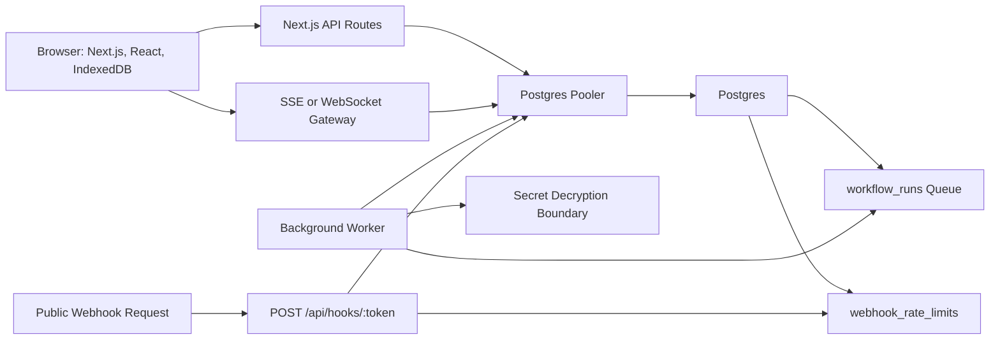

# Kinetk System Architecture

## 1. Overview

Kinetk is a local-first visual workflow builder backed by an event-log sync system and an asynchronous workflow execution engine.

The browser owns immediate editing responsiveness. The backend owns authorization, durable sync ordering, webhook trigger security, workflow execution, and run observability.

## 2. High-Level System Flow



Primary data movement:

1. The user edits a workflow in the browser.
2. The edit is applied to in-memory graph state and persisted to IndexedDB.
3. The edit is queued locally as a workflow event.
4. The browser sends unsynced events to `POST /api/sync`.
5. The backend validates workspace membership and appends accepted events to Postgres.
6. The backend assigns `server_revision` values and broadcasts committed events.
7. Other connected clients replay committed events.
8. Public webhook requests pass Postgres-backed rate limiting before run creation.
9. Accepted webhook requests enqueue workflow runs.
10. The worker executes each workflow step, decrypting referenced secrets only when needed, and writes sanitized step logs.
11. The UI reads run history and displays step-level observability.

## 3. Tech Stack Rationale

### Next.js

Next.js is a good fit because the project needs a polished React frontend, authenticated app routes, and backend API routes without splitting the MVP into multiple repositories. It keeps deployment simple while still allowing the worker to run as a separate process.

### TypeScript

TypeScript is required because workflow graphs, event payloads, node configurations, and execution logs need explicit contracts. Shared types between the editor, API, and worker reduce frontend/backend drift.

### React

React is suitable for the node editor shell, side panels, run history views, and state-driven UI. Performance-sensitive graph interactions should isolate hot paths and avoid rerendering the entire canvas during drag.

### IndexedDB

IndexedDB provides durable browser storage for local-first workflow editing. It can store workflow snapshots, pending events, sync metadata, and draft node configuration without requiring network availability.

### Postgres

Postgres is the system of record for users, workspaces, workflows, event logs, webhook triggers, runs, and step logs. The relational model supports tenant isolation, observability queries, and referential integrity.

Workspace secrets are also stored in Postgres, but secret values are encrypted with AES-256-GCM before persistence and are never embedded directly in workflow graph JSON.

The API, realtime gateway, and worker must connect through a Postgres connection pooler. This prevents independently scaled processes from exhausting database connections, especially when worker retries or bursty webhook traffic increase concurrency.

### Supabase

Supabase is the default backend for the no-cost MVP because it can cover Postgres, Auth, Realtime, and pooled database connections in one service. Keeping these concerns in one platform reduces integration work and avoids introducing Redis or a separate queue service before the product needs it.

Use Supabase Auth for user identity. Keep application authorization explicit in the service layer for the MVP, and consider Row-Level Security as a hardening upgrade after the core workflow path is stable.

### Postgres Queue and Rate Limits

For the no-cost MVP, Postgres is also the queue and rate-limit store:

- `workflow_runs` rows with `status = 'queued'` are the execution queue.
- A worker claims runs with a short lease using `SELECT ... FOR UPDATE SKIP LOCKED`.
- Failed HTTP request retries are represented by `next_attempt_at` and bounded attempt counters.
- Public webhook rate limits use a fixed-window `webhook_rate_limits` table keyed by `token_hash` and epoch second.

This is simpler than Redis/BullMQ and keeps the MVP inside the Supabase free tier. Redis plus BullMQ remains the scale upgrade if queue volume, delayed retries, or worker throughput outgrow Postgres polling.

### SSE or WebSockets

SSE is simpler for one-way server-to-client workflow updates. WebSockets are useful if the MVP later adds bidirectional presence or collaborative cursors.

For MVP, SSE is enough if durable edits are sent through the API and committed events are streamed back to clients.

### Supabase Postgres

Supabase Postgres is the default database choice for the MVP. It keeps Auth, Realtime, Postgres, and pooled connections together, which makes implementation smoother and lowers the chance of crossing multiple free-tier limits.

Use Supabase's pooled connection endpoint for server-side API and worker processes. If the project later moves away from Supabase or self-hosts Postgres, run PgBouncer in front of the database and point both API and worker processes at the pooled endpoint.

### Firebase Decision

Firebase is not the default backend for this project. Firebase Auth and Firestore can work for parts of the app, but the current design needs relational event logs, run history queries, encrypted secret rows, webhook execution, and background worker behavior. Those map more directly to Postgres. Firebase Spark also does not provide the full Cloud Functions/Cloud Run style backend needed for this workflow engine without moving toward Blaze billing risk.

## 4. Core Components

### 4.1 Browser App

Responsibilities:

- Render authenticated app shell.
- Store workflow graph state in memory.
- Persist workflow snapshots and pending events to IndexedDB.
- Render canvas nodes and edges.
- Manage undo and redo.
- Send sync batches to the backend.
- Subscribe to committed workflow events.
- Display run history and step logs.

Boundaries:

- The browser may optimistically apply local edits.
- The browser does not decide final event ordering.
- The browser does not execute trusted workflow runs.
- The browser must not assume local state is authoritative after reconnect if replay fails.

### 4.2 API Server

Responsibilities:

- Authenticate users.
- Authorize workspace access.
- Accept workflow sync batches.
- Assign server revisions.
- Manage workflow snapshots.
- Create and rotate webhook trigger tokens.
- Create, update, delete, and rotate encrypted workspace secrets.
- Accept public webhook trigger requests.
- Reject excess webhook traffic before workflow lookup or run creation.
- Create queued `workflow_runs` rows in Postgres.
- Expose run history and step logs.

Boundaries:

- The API validates all tenant access.
- The API does not perform long-running workflow execution in request handlers.
- The API treats public webhook trigger tokens as credentials.
- The API may receive plaintext secrets only over authenticated requests and must encrypt them before storage.

### 4.3 Realtime Gateway

Responsibilities:

- Authenticate the connecting user.
- Authorize access to a workflow room.
- Stream committed workflow events after a known revision.
- Notify clients when a snapshot refresh is required.

Room identity:

```txt
workflow:{workspace_id}:{workflow_id}
```

Join rule:

The user may join only if they are an active member of `workspace_id` and the workflow belongs to that workspace.

### 4.4 Worker

Responsibilities:

- Poll and lease queued workflow runs from Postgres.
- Load the workflow snapshot.
- Validate that the trigger and workflow are active.
- Parse the graph.
- Execute nodes in graph order.
- Resolve secret references and decrypt values only immediately before a node executes.
- Write `workflow_runs` and `workflow_step_runs`.
- Retry failed HTTP request steps according to policy.
- Enforce run-level timeout and maximum step count.

Boundaries:

- The worker logs step input/output/error snapshots.
- The worker masks configured sensitive values before persistence.
- The worker should make run completion idempotent.
- The worker must not place decrypted secrets in queue payloads, persisted workflow snapshots, step logs, or error details.

## 5. Sync Strategy

### 5.1 Event Log Model

Every durable workflow edit is stored as an event:

```txt
node_added
node_updated
node_moved
node_deleted
edge_added
edge_deleted
workflow_renamed
```

Each event has:

- `workflow_id`
- `workspace_id`
- `client_event_id`
- `actor_user_id`
- `event_type`
- `event_schema_version`
- `event_payload`
- `server_revision`
- `created_at`

`server_revision` is assigned by the backend and is monotonic per workflow.

`event_schema_version` records the payload shape used when the event was written. Clients migrate legacy event payloads to the current reducer schema before replaying them into local state.

### 5.2 Client Optimism

The client applies events immediately to local state and IndexedDB. Each local event starts as pending:

```txt
pending -> syncing -> committed
```

If the server rejects an event because the user lost access or the workflow was deleted, the client marks the workflow as requiring refresh.

### 5.3 Idempotency

Every client event uses a stable `client_event_id`, generated before the event is first persisted to IndexedDB.

The backend enforces uniqueness:

```txt
unique(workflow_id, client_event_id)
```

If the same event is submitted twice, the backend returns the already committed event instead of appending a duplicate.

### 5.4 Reconnection

On reconnect, the client sends:

```json
{
  "workflowId": "workflow_123",
  "lastServerRevision": 42
}
```

The server returns committed events after revision 42 if available.

If replay is possible:

1. Client applies missed events in revision order.
2. Client reconciles pending local events by `client_event_id`.
3. Client resumes live subscription.

If replay is not possible:

1. Server returns `snapshot_required`.
2. Client fetches the latest workflow snapshot.
3. Client preserves unsynced local events separately.
4. Client attempts to rebase pending local events or asks the user to refresh if rebase fails.

For MVP, the acceptable fallback is a clear `Refresh required` state if rebase is unsafe, but refresh must be gated by a conflict recovery UI:

- Show the server revision, local base revision, and count of unsynced local events.
- Show a diff summary when possible, such as node added, node deleted, edge changed, or config changed.
- Provide a `Download local copy` action that exports the local snapshot and pending events as JSON before replacing local state.
- Require explicit confirmation before discarding or overwriting local pending events.

## 6. Multi-Tenancy Model

Tenant boundary is the workspace.

Every tenant-owned table includes `workspace_id` either directly or through a required parent relation.

Tenant-owned resources:

- workflows
- workflow_events
- webhook_triggers
- workflow_secrets
- workflow_runs
- workflow_step_runs

### Middleware-Based Isolation

The MVP can use middleware/service-layer checks:

1. Authenticate user.
2. Resolve workspace membership.
3. Load resource by both `id` and `workspace_id`.
4. Reject access if membership is missing.

Example rule:

```txt
GET /api/workflows/:id/history
must load workflow where id = :id and workspace_id in user's memberships.
```

### Optional RLS Upgrade

If using Supabase or direct Postgres policies, Row-Level Security can enforce tenant filters at the database level. RLS is stronger but adds setup complexity. The MVP should document whether it uses RLS or middleware; it should not claim both unless both are implemented and tested.

Recommended MVP choice:

- Use service-layer tenant checks first.
- Add explicit integration tests for cross-tenant denial.
- Consider RLS as a later hardening phase.

## 7. Webhook Security

Webhook triggers use:

```txt
POST /api/hooks/:triggerToken
```

The raw token is shown once when created and stored hashed in Postgres.

Lookup flow:

1. Hash the incoming token.
2. Apply Postgres fixed-window rate limit by hashed trigger token.
3. Reject excess traffic before creating a workflow run.
4. Find an active `webhook_triggers` row by `token_hash`.
5. Load the workflow by `workflow_id` and `workspace_id`.
6. Enqueue a run with `workspace_id`, `workflow_id`, and `trigger_id`.
7. Return a constant-shape response.

Invalid, disabled, or unknown triggers should not reveal tenant or workflow details.

Rate limit policy:

- Default limit: 10 requests per second per trigger token.
- Algorithm: Postgres fixed window for MVP.
- Key shape: `(token_hash, window_start)` in `webhook_rate_limits`.
- Rate-limited requests return `429` with the same public response shape where practical and do not create workflow runs.
- Redis or Upstash can replace this table if webhook traffic grows.

## 8. Secret Storage

User-provided credentials are first-class tenant data, separate from workflow graph configuration.

Storage model:

- Store one row per workspace secret.
- Encrypt `secret_value` using AES-256-GCM.
- Store encryption metadata beside the ciphertext: key version, nonce, and auth tag.
- Keep secret display names, IDs, and timestamps queryable as plaintext metadata.
- Store a fingerprint or hash only if needed for duplicate detection; never store plaintext.

Key management:

- MVP can use an application-managed data encryption key from the deployment secret manager.
- The key should support versioning so secrets can be re-encrypted during rotation.
- A production hardening path is KMS-backed envelope encryption per workspace.

Runtime use:

- Workflow nodes reference `workflow_secrets.id`, not raw values.
- Queued run records and worker inputs carry secret IDs only.
- The worker authorizes the run's workspace, loads the secret row by `workspace_id`, decrypts in memory immediately before the HTTP request, and drops the plaintext after use.
- Sanitization treats configured secrets as redaction sources for inputs, outputs, headers, and errors.

## 9. Database Connection Management

The API server and background worker are separate processes, so they must not each open unbounded direct Postgres pools.

Required strategy:

- API, realtime, webhook, and worker processes use Supabase's pooled Postgres endpoint.
- If moving away from Supabase, prefer the hosting provider's pooler or PgBouncer.
- If the database provider does not include a pooler, deploy PgBouncer beside Postgres.
- Configure small per-process client pools and let PgBouncer multiplex connections to Postgres.
- Set explicit worker concurrency so Postgres polling cannot create more simultaneous database work than the pool budget allows.
- Keep queue retries bounded and backoff-based so a database incident does not create a retry storm.

Connection budgeting:

- Reserve capacity for authenticated API traffic before assigning worker concurrency.
- Treat worker concurrency as an operational setting, not only an application constant.
- Monitor active connections, pool saturation, queue depth, and run latency.

Operational summary:

```txt
The worker and API both use the pooled Postgres endpoint. Supabase pooling or PgBouncer prevents a scaled worker from consuming every database connection and locking the API out during retry spikes.
```

## 10. Infrastructure

### Local Development

Local services:

- Next.js web app
- Postgres
- Worker process

Recommended local orchestration:

- Docker Compose for Postgres
- `npm run dev` for Next.js
- `npm run worker:dev` for the worker

The repository should include a `docker-compose.yml` for local Postgres so the dependency stack can be reproduced without manually clicking through hosted dashboards.

### CI/CD and Infrastructure as Code

Recommended automation:

- GitHub Actions runs lint, typecheck, unit tests, integration tests, and Playwright smoke tests on pull requests.
- GitHub Actions deploys the Next.js app to Vercel.
- The worker can run locally for development and demo workflows; a separately hosted worker is a later deployment decision if always-on execution is needed.
- Environment variables are defined in documented templates such as `.env.example`; real values live in the hosting provider's secret manager.
- Local infrastructure is reproducible through `docker-compose.yml`.
- Hosted infrastructure should be documented as code where practical if the project grows beyond the no-cost MVP.

### Deployment

Recommended deployment:

- Frontend and API: Vercel
- Backend platform: Supabase Free for Postgres, Auth, Realtime, and pooled connections
- Queue and rate limits: Supabase Postgres tables
- Worker: local/dev worker for MVP demos; upgrade to a separate container service only when always-on execution is required

The worker should remain a separate process from the Next.js request path. For the strict no-cost MVP, it can run locally or on demand while developing and demoing. If the product needs unattended hosted execution, move the worker to a separate container service and revisit free-tier limits.

## 11. Failure Scenarios

### What happens if the internet cuts out while editing?

The edit is applied locally and stored in IndexedDB with a `client_event_id`. The UI shows `Saved locally`. When connectivity returns, pending events sync to the backend. The backend deduplicates events by `client_event_id`, assigns `server_revision`, and returns committed events. If the client missed remote events, it replays them after the last known revision or fetches a fresh snapshot.

### How do you stop me from seeing another workspace's logs?

Run and step log queries are scoped through workspace membership. The API loads the workflow or run only if its `workspace_id` belongs to the authenticated user. Step logs are loaded through the run and workspace boundary. Cross-tenant access tests verify that users cannot fetch workflows, runs, or step logs outside their workspace.

### What if someone deletes a node while another user renames it?

The MVP event model uses server ordering, not full CRDT merging. Events are committed in server revision order. If a later event references a deleted node, the reducer treats it as a no-op or marks the client for refresh depending on event type. This behavior is deterministic and documented, but it is not a full collaborative editing merge system.

### What happens when replay is too old and the client has unsynced work?

The server returns `snapshot_required`, but the client does not silently throw away pending local edits. It preserves the local snapshot and pending events, shows a conflict recovery screen with a diff summary where possible, offers a local JSON export, and only applies the server snapshot after explicit user confirmation or successful rebase.

### Where are user API keys stored?

HTTP request credentials are stored as encrypted workspace secrets, not in `.env` and not inside workflow graph JSON. Node config references a secret ID. The worker decrypts the value in memory only when executing the node, uses it for the outbound request, then logs only sanitized payloads with the secret redacted.

### How do you keep the worker from exhausting database connections?

The API, realtime gateway, webhook handler, and worker all connect through Supabase's pooled Postgres endpoint. Worker concurrency is capped against the pool budget, leaving reserved connection capacity for user-facing API requests even during webhook bursts or retry spikes.
