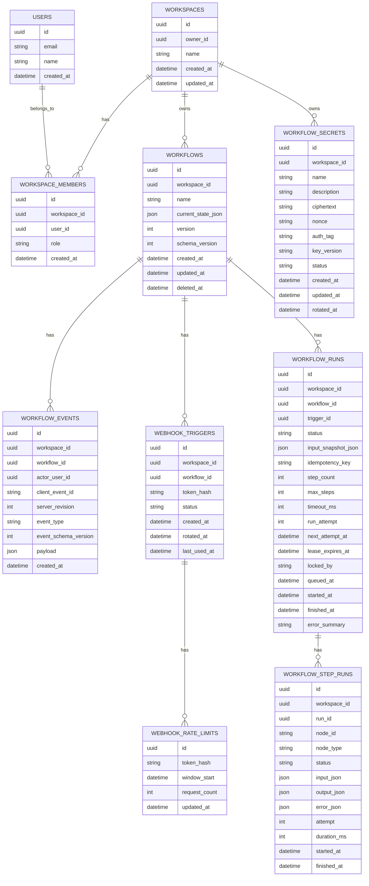

# Kinetk API and Data Schema Specification

## 1. Purpose

This document defines the backend contract for Kinetk's MVP. It exists to keep the frontend, backend, sync engine, and worker aligned before implementation starts.

Primary guarantees:

- Every tenant-owned query is scoped to a workspace.
- Workflow edits are synchronized through idempotent append-only events.
- Public webhook triggers do not expose workflow IDs.
- User-provided credentials are stored as encrypted workspace secrets.
- Public webhook traffic is rate limited before workflow lookup and run creation.
- Historical workflow events are replayable through explicit schema versions and migration helpers.
- Execution logs are queryable at run and step level.

## 2. Data Model

The following schema is written as implementation-ready relational design. Exact ORM syntax can be defined during implementation.

## 3. Entity Relationship Overview



## 4. Tables

### 4.1 users

Stores application user profiles mirrored from Supabase Auth.

Columns:

- `id uuid primary key`
- `email text not null unique`
- `name text`
- `created_at timestamp not null`

Provider rule:

- `id` should match the Supabase Auth user ID.
- Authentication state comes from Supabase Auth; this table stores app-specific profile data.

### 4.2 workspaces

Stores tenant boundaries.

Columns:

- `id uuid primary key`
- `owner_id uuid not null references users(id)`
- `name text not null`
- `created_at timestamp not null`
- `updated_at timestamp not null`

Tenant rule:

- A user may access a workspace only through `workspace_members`.

### 4.3 workspace_members

Maps users to workspaces.

Columns:

- `id uuid primary key`
- `workspace_id uuid not null references workspaces(id)`
- `user_id uuid not null references users(id)`
- `role text not null check role in ('owner', 'member')`
- `created_at timestamp not null`

Indexes and constraints:

- `unique(workspace_id, user_id)`
- `index(user_id)`

### 4.4 workflows

Stores workflow snapshots.

Columns:

- `id uuid primary key`
- `workspace_id uuid not null references workspaces(id)`
- `name text not null`
- `current_state_json jsonb not null`
- `version int not null default 0`
- `schema_version int not null default 1`
- `created_at timestamp not null`
- `updated_at timestamp not null`
- `deleted_at timestamp`

Indexes:

- `index(workspace_id)`
- `index(workspace_id, deleted_at)`

Tenant rule:

- Load workflows by both `id` and a workspace the user belongs to.

### 4.5 workflow_events

Append-only event log for workflow graph changes.

Columns:

- `id uuid primary key`
- `workspace_id uuid not null references workspaces(id)`
- `workflow_id uuid not null references workflows(id)`
- `actor_user_id uuid not null references users(id)`
- `client_event_id text not null`
- `server_revision int not null`
- `event_type text not null`
- `event_schema_version int not null default 1`
- `payload jsonb not null`
- `created_at timestamp not null`

Indexes and constraints:

- `unique(workflow_id, client_event_id)`
- `unique(workflow_id, server_revision)`
- `index(workspace_id, workflow_id, server_revision)`

Allowed event types:

- `workflow_renamed`
- `node_added`
- `node_updated`
- `node_moved`
- `node_deleted`
- `edge_added`
- `edge_deleted`

Tenant rule:

- The event's `workspace_id` must match the parent workflow's `workspace_id`.

Schema evolution rule:

- `event_schema_version` records the payload shape used when the event was written.
- New clients must replay events through a migration helper before applying them to local reducer state.
- The migration helper is deterministic and maps legacy event payloads to the current event schema.
- The server may store old event payloads unchanged; compatibility belongs in explicit migration code, not ad hoc reducer branching.
- `workflows.schema_version` records the schema version of `current_state_json`.
- Snapshot reads return `schema_version` so clients know whether to migrate the snapshot before loading it into the editor.

### 4.6 webhook_triggers

Stores public trigger credentials.

Columns:

- `id uuid primary key`
- `workspace_id uuid not null references workspaces(id)`
- `workflow_id uuid not null references workflows(id)`
- `token_hash text not null unique`
- `status text not null check status in ('active', 'disabled')`
- `created_at timestamp not null`
- `rotated_at timestamp`
- `last_used_at timestamp`

Security rule:

- The raw trigger token is shown only at creation or rotation.
- The database stores only `token_hash`.
- Public lookup is by `token_hash`, then workflow is loaded through `workspace_id`.

### 4.7 webhook_rate_limits

Stores fixed-window counters for public webhook traffic.

Columns:

- `id uuid primary key`
- `token_hash text not null`
- `window_start timestamp not null`
- `request_count int not null default 0`
- `updated_at timestamp not null`

Indexes and constraints:

- `unique(token_hash, window_start)`
- `index(window_start)`

Security rule:

- Use the hashed trigger token, never the raw trigger token.
- Increment this counter before workflow lookup or run creation.
- Reject the request if `request_count` exceeds the policy limit.

Cleanup rule:

- Delete windows older than the operational retention period, such as 24 hours.

### 4.8 workflow_secrets

Stores encrypted user-provided credentials for workflow nodes.

Columns:

- `id uuid primary key`
- `workspace_id uuid not null references workspaces(id)`
- `name text not null`
- `description text`
- `ciphertext text not null`
- `nonce text not null`
- `auth_tag text not null`
- `key_version text not null`
- `status text not null check status in ('active', 'disabled')`
- `created_at timestamp not null`
- `updated_at timestamp not null`
- `rotated_at timestamp`

Indexes:

- `index(workspace_id)`
- `unique(workspace_id, name)`

Encryption rule:

- `ciphertext` is produced with AES-256-GCM.
- `nonce` must be unique for the encryption key.
- `auth_tag` is verified before the secret is used.
- `key_version` identifies the data encryption key used so secrets can be re-encrypted during rotation.

Security rule:

- Plaintext secret values are accepted only over authenticated workspace-scoped API requests.
- Plaintext secret values are never returned by API responses.
- Workflow graph JSON stores secret references by `secretId`, never raw secret values.
- The worker loads secrets by both `workspace_id` and `id`, decrypts only during node execution, and redacts the value before writing logs.

Tenant rule:

- Secret queries are scoped through `workspace_id`.

### 4.9 workflow_runs

Stores one workflow execution attempt.

Columns:

- `id uuid primary key`
- `workspace_id uuid not null references workspaces(id)`
- `workflow_id uuid not null references workflows(id)`
- `trigger_id uuid references webhook_triggers(id)`
- `status text not null check status in ('queued', 'running', 'succeeded', 'failed', 'canceled')`
- `input_snapshot_json jsonb not null`
- `idempotency_key text not null`
- `step_count int not null default 0`
- `max_steps int not null default 50`
- `timeout_ms int not null default 300000`
- `run_attempt int not null default 0`
- `next_attempt_at timestamp`
- `lease_expires_at timestamp`
- `locked_by text`
- `queued_at timestamp not null`
- `started_at timestamp`
- `finished_at timestamp`
- `error_summary text`

Indexes and constraints:

- `unique(workflow_id, idempotency_key)`
- `index(workspace_id, workflow_id, queued_at desc)`
- `index(status, next_attempt_at)`
- `index(lease_expires_at)`

Tenant rule:

- Run queries are scoped through `workspace_id`.

Queue rule:

- `workflow_runs` doubles as the MVP execution queue.
- The worker claims queued runs using a short database lease.
- A claim query should use row-level locking, for example `FOR UPDATE SKIP LOCKED`, so multiple workers do not execute the same run.
- `next_attempt_at` controls retry timing without a Redis delayed queue.
- `lease_expires_at` lets a crashed worker's run become claimable again.

### 4.10 workflow_step_runs

Stores one node execution within a run.

Columns:

- `id uuid primary key`
- `workspace_id uuid not null references workspaces(id)`
- `run_id uuid not null references workflow_runs(id)`
- `node_id text not null`
- `node_type text not null`
- `status text not null check status in ('pending', 'running', 'succeeded', 'failed', 'skipped')`
- `input_json jsonb`
- `output_json jsonb`
- `error_json jsonb`
- `attempt int not null default 1`
- `duration_ms int`
- `started_at timestamp`
- `finished_at timestamp`

Indexes:

- `index(workspace_id, run_id)`
- `index(run_id, node_id)`

Tenant rule:

- Step logs are loaded through a run that belongs to the user's workspace.

## 5. Workflow Graph JSON

`workflows.current_state_json` stores a graph snapshot.

Example:

```json
{
  "nodes": [
    {
      "id": "node_trigger_1",
      "type": "webhook_trigger",
      "position": { "x": 120, "y": 180 },
      "config": {}
    },
    {
      "id": "node_transform_1",
      "type": "transform_json",
      "position": { "x": 420, "y": 180 },
      "config": {
        "expression": "{ \"email\": input.body.email }"
      }
    },
    {
      "id": "node_http_1",
      "type": "http_request",
      "position": { "x": 720, "y": 180 },
      "config": {
        "method": "POST",
        "url": "https://example.com/hook",
        "headers": {
          "authorization": {
            "secretId": "secret_123",
            "injectAs": "Bearer"
          }
        },
        "bodyMode": "current_payload"
      }
    }
  ],
  "edges": [
    {
      "id": "edge_1",
      "sourceNodeId": "node_trigger_1",
      "sourceHandle": "success",
      "targetNodeId": "node_transform_1",
      "targetHandle": "input"
    }
  ],
  "viewport": {
    "x": 0,
    "y": 0,
    "zoom": 1
  }
}
```

## 6. API Endpoints

All authenticated API endpoints require a valid session.

### 6.1 GET /api/workspaces

Returns workspaces for the current user.

Response:

```json
{
  "workspaces": [
    {
      "id": "workspace_123",
      "name": "Acme Integrations",
      "role": "owner"
    }
  ]
}
```

Tenant check:

- Return only memberships for the current user.

### 6.2 POST /api/workflows

Creates a workflow in a workspace.

Request:

```json
{
  "workspaceId": "workspace_123",
  "name": "Stripe webhook test"
}
```

Response:

```json
{
  "workflow": {
    "id": "workflow_123",
    "workspaceId": "workspace_123",
    "name": "Stripe webhook test",
    "version": 0,
    "schemaVersion": 1,
    "currentState": {
      "nodes": [],
      "edges": [],
      "viewport": { "x": 0, "y": 0, "zoom": 1 }
    }
  }
}
```

Tenant check:

- User must be a member of `workspaceId`.

### 6.3 GET /api/workflows/:id

Fetches a workflow snapshot.

Response:

```json
{
  "workflow": {
    "id": "workflow_123",
    "workspaceId": "workspace_123",
    "name": "Stripe webhook test",
    "version": 12,
    "schemaVersion": 1,
    "currentState": {
      "nodes": [],
      "edges": [],
      "viewport": { "x": 0, "y": 0, "zoom": 1 }
    },
    "latestServerRevision": 42
  }
}
```

Tenant check:

- Load by workflow ID and a workspace the current user belongs to.

### 6.4 POST /api/sync

Synchronizes a batch of client workflow events.

Request:

```json
{
  "workflowId": "workflow_123",
  "baseServerRevision": 42,
  "events": [
    {
      "clientEventId": "client_evt_01HZY",
      "type": "node_moved",
      "eventSchemaVersion": 1,
      "payload": {
        "nodeId": "node_transform_1",
        "position": { "x": 500, "y": 240 }
      },
      "createdAt": "2026-05-13T20:00:00.000Z"
    }
  ]
}
```

Response:

```json
{
  "status": "accepted",
  "committedEvents": [
    {
      "id": "event_123",
      "clientEventId": "client_evt_01HZY",
      "serverRevision": 43,
      "type": "node_moved",
      "eventSchemaVersion": 1,
      "payload": {
        "nodeId": "node_transform_1",
        "position": { "x": 500, "y": 240 }
      },
      "actorUserId": "user_123",
      "createdAt": "2026-05-13T20:00:01.000Z"
    }
  ],
  "latestServerRevision": 43
}
```

Duplicate response:

```json
{
  "status": "accepted",
  "committedEvents": [
    {
      "id": "event_123",
      "clientEventId": "client_evt_01HZY",
      "serverRevision": 43,
      "type": "node_moved",
      "eventSchemaVersion": 1,
      "payload": {
        "nodeId": "node_transform_1",
        "position": { "x": 500, "y": 240 }
      },
      "actorUserId": "user_123",
      "createdAt": "2026-05-13T20:00:01.000Z"
    }
  ],
  "latestServerRevision": 43
}
```

Snapshot required response:

```json
{
  "status": "snapshot_required",
  "reason": "base_revision_too_old",
  "latestServerRevision": 80
}
```

Tenant check:

- User must belong to the workflow's workspace.
- The event `workspace_id` is derived server-side from the workflow, not trusted from the client.

Idempotency:

- `unique(workflow_id, client_event_id)` prevents duplicates.
- Duplicate events return the original committed event.

Schema compatibility:

- Clients include `eventSchemaVersion` for every submitted event.
- The server validates that the version is supported before appending the event.
- Events returned by sync and replay include `eventSchemaVersion`.
- Before applying any committed event, the client calls `migrateWorkflowEvent(event)` to convert legacy payloads into the current reducer shape.
- Migration helpers are pure functions covered by tests, for example `v1 node_updated.http_request.headers` to the current `secretId` reference shape.

Client conflict behavior:

- If the response is `snapshot_required`, the client must preserve local pending events.
- If pending events cannot be rebased, the client shows conflict recovery rather than replacing local state immediately.
- The conflict recovery UI should include a diff summary when possible and a `Download local copy` action that exports the local snapshot plus pending events.

### 6.5 GET /api/workflows/:id/events?afterRevision=42

Fetches committed events after a known revision.

Response:

```json
{
  "events": [
    {
      "id": "event_124",
      "clientEventId": "client_evt_remote_1",
      "serverRevision": 43,
      "type": "node_updated",
      "eventSchemaVersion": 1,
      "payload": {
        "nodeId": "node_http_1",
        "config": {
          "url": "https://example.com/hook",
          "method": "POST"
        }
      },
      "actorUserId": "user_456",
      "createdAt": "2026-05-13T20:01:00.000Z"
    }
  ],
  "latestServerRevision": 43
}
```

Tenant check:

- User must belong to the workflow's workspace.

### 6.6 POST /api/workflows/:id/triggers

Creates or rotates a webhook trigger.

Response:

```json
{
  "trigger": {
    "id": "trigger_123",
    "workflowId": "workflow_123",
    "status": "active",
    "url": "https://app.example.com/api/hooks/ff_live_abc123",
    "createdAt": "2026-05-13T20:02:00.000Z"
  }
}
```

Security:

- Raw token is returned only in this response.
- Token hash is stored in `webhook_triggers.token_hash`.

Tenant check:

- User must belong to the workflow's workspace.

### 6.7 POST /api/hooks/:token

Public unauthenticated webhook trigger endpoint.

Request:

```json
{
  "event": "payment.created",
  "email": "developer@example.com",
  "amount": 4900
}
```

Response for accepted request:

```json
{
  "accepted": true,
  "runId": "run_123"
}
```

Response for invalid, disabled, or unknown trigger:

```json
{
  "accepted": false
}
```

Response for rate-limited request:

```json
{
  "accepted": false
}
```

Security:

- Hash incoming token.
- Enforce rate limit with `webhook_rate_limits` before workflow lookup or run creation.
- Lookup active trigger by hash.
- Load workflow through trigger `workspace_id`.
- Create a `workflow_runs` row with `status = 'queued'`, `workspace_id`, `workflow_id`, and `trigger_id`.
- Do not expose whether a workspace, workflow, or token exists.

Rate limit policy:

- Limit: 10 requests per second per trigger token.
- MVP algorithm: Postgres fixed window using `webhook_rate_limits`.
- Window key: `unique(token_hash, window_start)`, where `window_start` is truncated to the second.
- Reject requests once the counter exceeds 10.
- Rejected requests must not create `workflow_runs` rows.
- A future upgrade may use Upstash Redis with a leaky bucket or token bucket for smoother bursts.

### 6.8 GET /api/secrets

Lists encrypted secret metadata for a workspace.

Query parameters:

- `workspaceId`: required

Response:

```json
{
  "secrets": [
    {
      "id": "secret_123",
      "workspaceId": "workspace_123",
      "name": "Notify API token",
      "description": "Bearer token for the internal notification API",
      "status": "active",
      "createdAt": "2026-05-13T20:02:00.000Z",
      "updatedAt": "2026-05-13T20:02:00.000Z",
      "rotatedAt": null
    }
  ]
}
```

Security:

- Never return plaintext or ciphertext fields.

Tenant check:

- User must belong to `workspaceId`.

### 6.9 POST /api/secrets

Creates an encrypted workspace secret.

Request:

```json
{
  "workspaceId": "workspace_123",
  "name": "Notify API token",
  "description": "Bearer token for the internal notification API",
  "value": "plain-token-value"
}
```

Response:

```json
{
  "secret": {
    "id": "secret_123",
    "workspaceId": "workspace_123",
    "name": "Notify API token",
    "description": "Bearer token for the internal notification API",
    "status": "active",
    "createdAt": "2026-05-13T20:02:00.000Z",
    "updatedAt": "2026-05-13T20:02:00.000Z"
  }
}
```

Security:

- Encrypt `value` with AES-256-GCM before persistence.
- Store ciphertext, nonce, auth tag, and key version.
- Do not return the plaintext value.

Tenant check:

- User must belong to `workspaceId`.

### 6.10 GET /api/workflows/:id/history

Fetches run history for a workflow.

Query parameters:

- `limit`: default 25, max 100
- `cursor`: optional pagination cursor

Response:

```json
{
  "runs": [
    {
      "id": "run_123",
      "workflowId": "workflow_123",
      "status": "failed",
      "queuedAt": "2026-05-13T20:03:00.000Z",
      "startedAt": "2026-05-13T20:03:01.000Z",
      "finishedAt": "2026-05-13T20:03:04.000Z",
      "stepCount": 3,
      "maxSteps": 50,
      "timeoutMs": 300000,
      "errorSummary": "HTTP request failed with status 500"
    }
  ],
  "nextCursor": null
}
```

Tenant check:

- User must belong to the workflow's workspace.

### 6.11 GET /api/runs/:id

Fetches run details with step logs.

Response:

```json
{
  "run": {
    "id": "run_123",
    "workflowId": "workflow_123",
    "status": "failed",
    "inputSnapshot": {
      "headers": {
        "content-type": "application/json"
      },
      "body": {
        "event": "payment.created",
        "email": "developer@example.com"
      }
    },
    "steps": [
      {
        "id": "step_123",
        "nodeId": "node_transform_1",
        "nodeType": "transform_json",
        "status": "succeeded",
        "input": {
          "event": "payment.created",
          "email": "developer@example.com"
        },
        "output": {
          "email": "developer@example.com"
        },
        "error": null,
        "attempt": 1,
        "durationMs": 12,
        "startedAt": "2026-05-13T20:03:01.000Z",
        "finishedAt": "2026-05-13T20:03:01.012Z"
      }
    ]
  }
}
```

Tenant check:

- Load run by `id`.
- Verify `run.workspace_id` is in the current user's memberships.
- Load step logs by `workspace_id` and `run_id`.

## 7. Realtime Events

MVP can use SSE:

```txt
GET /api/workflows/:id/stream?afterRevision=42
```

Authentication:

- Requires current user session.

Authorization:

- User must belong to the workflow's workspace.

### 7.1 event: workflow.event_committed

Payload:

```json
{
  "type": "workflow.event_committed",
  "workflowId": "workflow_123",
  "event": {
    "id": "event_123",
    "clientEventId": "client_evt_01HZY",
    "serverRevision": 43,
    "type": "node_moved",
    "eventSchemaVersion": 1,
    "payload": {
      "nodeId": "node_transform_1",
      "position": { "x": 500, "y": 240 }
    },
    "actorUserId": "user_123",
    "createdAt": "2026-05-13T20:00:01.000Z"
  }
}
```

Client behavior:

- If `clientEventId` is already applied locally, mark local event committed.
- If not applied, migrate the event to the current schema and apply it in `serverRevision` order.
- If revision order has a gap, pause live application and request missed events.

### 7.2 event: workflow.snapshot_required

Payload:

```json
{
  "type": "workflow.snapshot_required",
  "workflowId": "workflow_123",
  "reason": "revision_gap",
  "latestServerRevision": 80
}
```

Client behavior:

- Show `Refresh required`.
- Fetch latest workflow snapshot.
- Preserve pending local events separately.
- If pending events exist and cannot be rebased, show conflict recovery before applying the snapshot.
- Offer a `Download local copy` action containing the current local graph and pending event queue.

### 7.3 event: workflow.run_updated

Payload:

```json
{
  "type": "workflow.run_updated",
  "workflowId": "workflow_123",
  "runId": "run_123",
  "status": "failed"
}
```

Client behavior:

- Refresh run list or update cached run status.

## 8. Schema Evolution

Append-only events must remain replayable after the application changes. The MVP uses explicit schema versions instead of assuming all historical events match the latest TypeScript types.

Current version fields:

- `workflows.schema_version`: version of `current_state_json`.
- `workflow_events.event_schema_version`: version of the event payload shape.
- API field names: `schemaVersion` and `eventSchemaVersion`.

Replay strategy:

1. Fetch events after the client's known revision.
2. For each event, call `migrateWorkflowEvent(event)` before reducer application.
3. Apply only migrated current-version events to local state.
4. If an event version is unsupported, stop replay and request `snapshot_required`.
5. When fetching a snapshot, call `migrateWorkflowSnapshot(snapshot)` if `schemaVersion` is older than the current editor schema.

Migration helper requirements:

- Migrations are pure functions with no network calls.
- Migrations are sequential, for example `v1 -> v2 -> v3`.
- Legacy payloads are not mutated in place.
- Tests cover representative old event shapes for each supported migration.
- Reducers should receive only the current event schema after migration.

Example:

```ts
function migrateWorkflowEvent(event: WorkflowEvent): CurrentWorkflowEvent {
  if (event.eventSchemaVersion === 1) {
    return migrateEventV1ToCurrent(event);
  }

  if (event.eventSchemaVersion === CURRENT_EVENT_SCHEMA_VERSION) {
    return event;
  }

  throw new UnsupportedEventSchemaError(event.eventSchemaVersion);
}
```

## 9. API Error Format

Authenticated API errors use:

```json
{
  "error": {
    "code": "forbidden",
    "message": "You do not have access to this resource."
  }
}
```

Public webhook errors use constant-shape responses:

```json
{
  "accepted": false
}
```

## 10. Required Backend Contract Tests

- User cannot fetch workflow from another workspace.
- User cannot sync events to workflow from another workspace.
- User cannot fetch run history from another workspace.
- User cannot fetch step logs from another workspace.
- User cannot join realtime stream for workflow from another workspace.
- Public webhook trigger does not expose tenant or workflow details for invalid tokens.
- Disabled webhook trigger does not enqueue a run.
- Rate-limited webhook request does not query workflow details or enqueue a run.
- User cannot list or create secrets in another workspace.
- Secret APIs never return plaintext or ciphertext values.
- Legacy workflow event payload is migrated before reducer application.
- Unsupported event schema version triggers `snapshot_required` instead of crashing replay.
